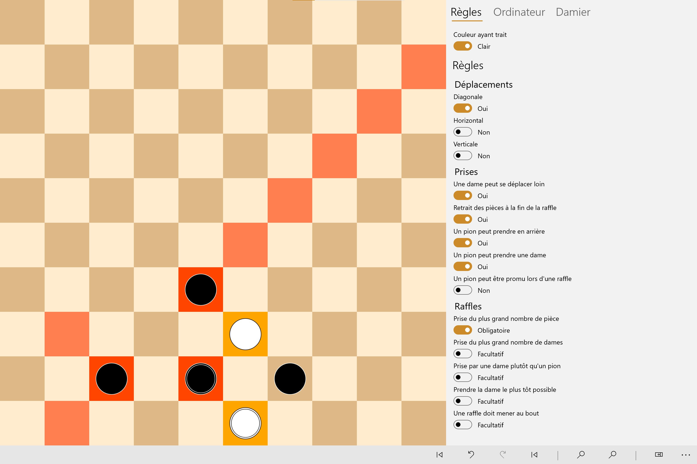
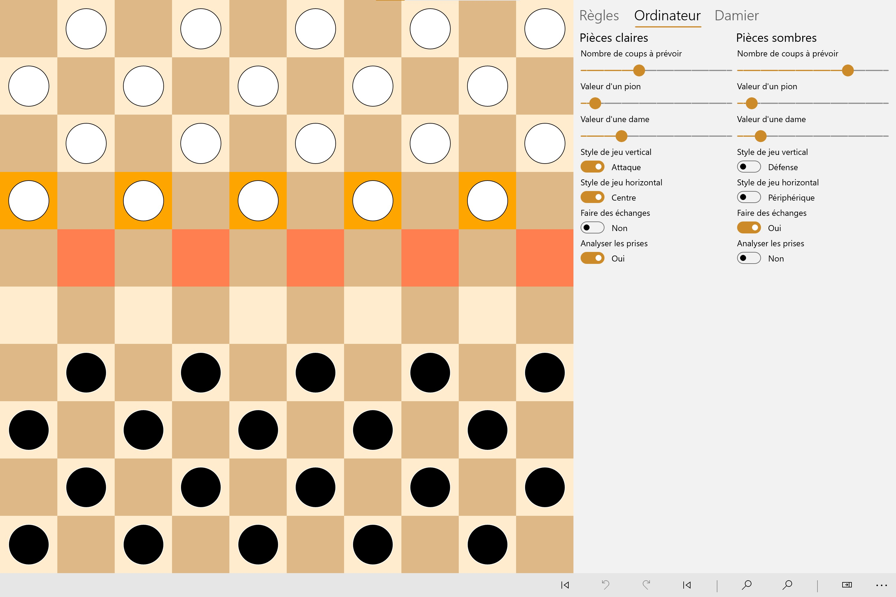

# Jeu de dames UWP
Réalisation d’une application pour découvrir le jeu de dames sous toutes ses formes en supportant plus d’une dizaine de règles combinables. La recherche d’un coup optimal est possible peu importe les règles et paramétrable pour simuler diverses IA. Permet la génération d’études (problémisme) en se basant sur l’affrontement entre deux IA aboutissant dans une situation où les blancs peuvent forcer l’obtention d’une dame. Écrit en C++ pour la plateforme UWP.
## Règles
L'algorithme accepte de nombreux paramètres ce qui permet de jouer à de nombreuses variantes du jeu de dames mais également de tester plusieurs milliers de combinaisons.
- Déplacement diagonal, horizontal, ou vertical
- Déplacement court ou long de la dame
- Retrait des pièces à la fin ou durant une rafle
- Un pion peut ou non prendre en arrière
- Un pion peut ou non prendre une dame
- Un pion peut être promu ou non lors d'une rafle
- Prise du plus grand nombre de pièce
- Prise du plus grand nombre de dames
- Prise par une dame plutôt qu'un pion
- Prise de la dame le plus tôt possible
- Une raffle doit mener au bout

## Algorithme de meilleur coup
La recherche d’un coup optimal repose sur un algorithme MinMax est possible peu importe les règles et accepte différents paramètres pour générer différents styles de jeu.
- Nombre de coups à prévoir (de l'ordre de la seconde jusqu'à 6-7 coups, au delà la complexité explose)
- Analyse approfondie des prises (explore davantage les prises que les déplacements, ce qui permet de réduire l'arbre des possibilités uniquement aux cas intéressants)
- Valeur d'un pion (typiquement 1)
- Valeur d'une dame (habituellement 3 dans le cas de la variante internationale)
- Style de jeu vertical (jouer agressif ou défensif)
- Style de jeu horizontal (aller vers le centre ou vers les extérieurs)
- Faire des échanges (lorsque deux chemins ont le même poids)

## Problémisme
La génération d’études se base sur l’affrontement de deux algorithmes de meilleur coup à partir d'une situation de jeu aléatoire aboutissant dans une situation où les blancs peuvent forcer l’obtention d’une dame en un certain nombre de coups.

